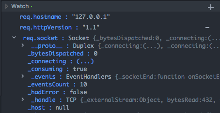

# Atom-js-debug

> JavaScript / Node.js debug client for Atom.

## Table of Contents

- [Installation](#installation)
- [Usage](#usage)
  - [Debug Node.js](#debug-node.js)
  - [Features](#features)
  - [Command Palette](#command-palette)
- [Configuration](#configuration)
- [Todo list](#todo-list)

## Installation

Currently atom-js-debug hasn't been published to atom package registry yet.So you must clone this repo, put it under your .atom/packages and make an npm install inside it to use this plugin.

[^_^]:
    Atom Packages: [Pending](#)

    ```
      apm install atom-js-debug
    ```

    Or Settings/Preference -> Packages -> Search for atom-js-debug

## Usage

### Debug Node.js

#### Start Debug
1. Toggle Atom-js-debug panel by click "Packages" - "Js Debug" - "Toggle" in menu.
2. Select "Local nodejs inspect debugger" in "Runner".
3. Input node binary path(>=v6.3.0) an js file path.
4. Click Debug to start node process and debug it.

#### Debug Interface

##### Overview


1. Add/remove breakpoints in gutters on the left of line numbers.
2. Scopes to display object properties.
3. Add/remove watched expressions.
4. File name, function name and line number of callframes.
5. Enable, disable, remove breakpoints.
6. Loaded javascript file.
7. Evaluate any expression in current context.
8. Resume, pause, step into, step next, step out.

##### Action bar


1. The buttons in action bar are, from left to right: Resume/Pause(F8), Step over(F10), Step into(F11), Step out(shift+F11), Stop debug and configuration.

##### Scopes


1. A green dot in title indicates scope loading finished. And a spin in title indicates scope loading not finished, thus the scope tab won't accept any operation.
2. The arrow on the left of variable name indicates the variable is an object/array.Click on the variable name to expand/collapse the properties in it.
3. ES6 Getters will be display in (...), they won't be evaluate and display value unless you click the (...)
4. Double click property to copy it's value to clipboard.

##### Watch



1. Use watch panel to watch some javascript expressions, they will be evaluated when script paused.
2. Remove all watched expressions by right-click context menu.

##### Callframes


1. Callframes panel list all current call frame including function name, file name and line number when script paused.
2. Click any call frame to open target file and highlight target line.

##### Breakpoints


1. Breakpoints panel list all breakpoints with their file name, line number and status.
2. Enable "Pause on All Exceptions" to pause on any exception. Enable "Pause on Uncaught Exceptions" to pause on uncaught exceptions.This means the debugger will pause before the error throw and you get a chance to inspect what may have gone wrong.
3. Toggle the checkbox on the left side of breakpoint to enable/disable it.
4. Click on the minus sign to remove target breakpoint.
5. Remove , disable or enable all breakpoints by right-click context-menu.
6. Click on any breakpoint to open target file and move cursor to target line.

##### File


1. The files panel will list all JS script parsed by JS engine.
2. Click on any JS file to open it in editor, if target file isn't located in your project folder, it will be save in a temporary folder before open.

##### Console


1. You can evaluate any javascript expression to see return value in console panel.
2. Any properties of object/array won't be fetched until you click to expand them, so the value may change between you evaluate the expression and you click to expand them.

### Features


* Live edit(modify javascript code during debugging)
* Object preview(some properties of object/array will be fetched before expand)
* Add expression to watch and display value of expression by Hyperclick
* Run to cursor

### Command Palette

* 'atom-js-debug:start'
* 'atom-js-debug:resume-or-pause':F8
* 'atom-js-debug:step-over':F10
* 'atom-js-debug:step-into':F11
* 'atom-js-debug:step-out':shift-F11

## Configuration

You can toggle Hyperclick support, Live edit and object preview features in Preferences/Settings


## Todo list

* Support attach to process
* Support debug remote project
* Support source map
* Support column breakpoint
* Support uglified code
...

